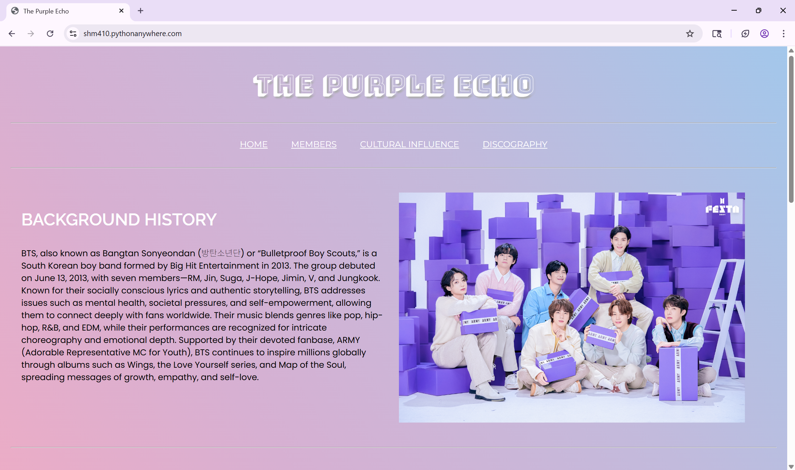

# The Purple Echo 🎵
### BTS Informational & Full-Stack Web Application
**Role: Full-Stack Developer**

The Purple Echo is a full-stack web application developed as the capstone project for the course Programming Languages for Web Applications. The site presents curated, research-based content on BTS’s discography, member profiles, and cultural impact, blending a technical backend with a polished, user-centric frontend.

This project demonstrates the ability to organize complex information into a navigable digital experience, balancing academic research with modern web development practices.

🌟 **[View the Live Website here!](https://shm410.pythonanywhere.com/)** 

Homepage Screenshot: 



## 📌 Project Context
- **Course**: Programming Languages for Web Applications

- **Developer**: Shruti Mali

- **Duration**: Oct 2025 – Dec 2025

- **Objective**: Demonstrate full-stack proficiency, focusing on dynamic content rendering, database integration, and responsive design.

## 🛠️ Tech Stack
- **Backend**: Python 3.8+ with Flask

- **Database & Data**: 
    - SQLAlchemy ORM for persistent user data (e.g., Favorites system).
    - JSON for structured, lightweight content storage (e.g., Discography metadata).

- **Frontend**: HTML5, CSS3 (Responsive), and Vanilla JavaScript.

- **Templating**: Jinja2 for dynamic HTML rendering.

## ✨ Key Features
- **Dynamic Discography**: Renders album and track metadata stored in JSON, allowing for easy content updates.

- **Interactive Favorites System**: A persistent feature powered by SQLAlchemy, allowing users to save and manage their favorite tracks/moments.

- **Cultural Context**: Detailed sections on the "Korean Wave" (Hallyu) and BTS’s global influence.

- **Responsive Design**: Fully optimized for both desktop and mobile viewing.

## 🚀 Quick Start (Windows)
To run this project locally, follow these steps:

1. Create and activate a virtual environment:


```bash
python -m venv venv
.\venv\Scripts\Activate.ps1
```

2. Install dependencies:


```bash
pip install Flask Flask-SQLAlchemy
```

3. Initialize & Run:

```bash
python app.py
```
> Note: On the first run, SQLAlchemy will initialize the local database file.

4. Access the site: Open http://127.0.0.1:5000 in your browser.

## 📂 Project Structure
- `app.py` – Flask application entry point and SQLAlchemy models.

- `data/` – JSON files (albums.json) containing discography metadata.

- `static/` – CSS styles, client-side JavaScript (favorites.js), and image assets.

- `templates/` – Jinja2 templates (Home, Members, Discography).

- `instance/` – (Generated) Contains the SQLite database file for SQLAlchemy.

## 📖 What I Learned
- **Hybrid Data Handling**: Implementing a workflow that uses both static JSON for speed and SQLAlchemy for persistent user-generated data.

- **UX/UI Design**: Structuring large volumes of informational content for clear discovery and high usability.

- **Full-Stack Architecture**: Connecting a Python backend to an interactive JS frontend through RESTful patterns.

## ⚠️ Disclaimer
This is a fan-made, non-commercial project created for educational purposes. **All names, images, and references related to BTS are the property of HYBE / BigHit Music**. No copyright infringement is intended.
